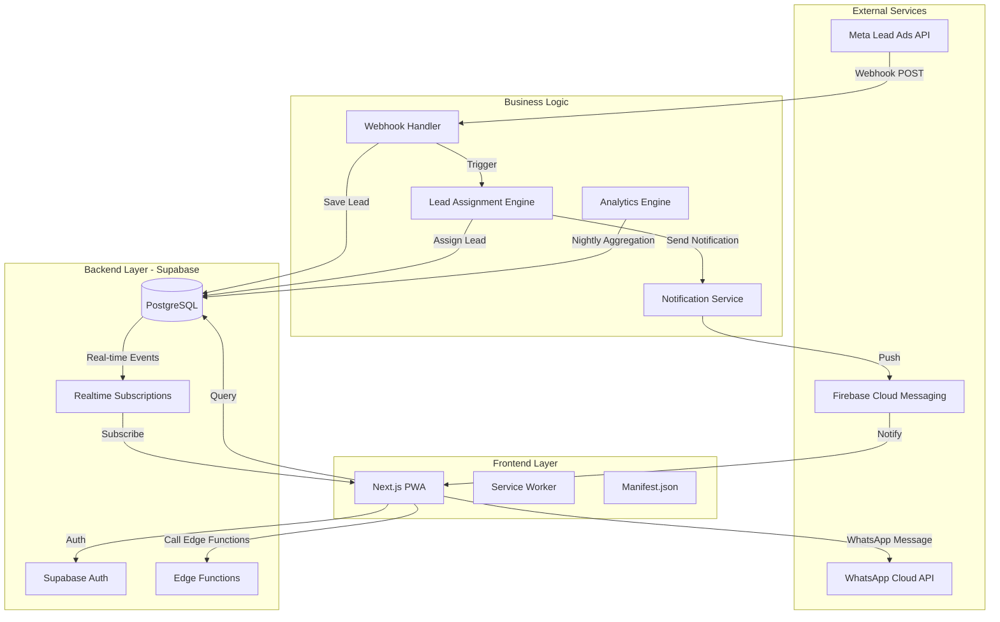

# Design Document - HLL Lead Management System

## Overview

HLL (HommLink Lead), event-driven mimari üzerine kurulu, Progressive Web App (PWA) olarak tasarlanmış bir lead yönetim sistemidir. Sistem, Meta Lead Ads entegrasyonu ile gelen lead'leri otomatik olarak işler, akıllı algoritma ile temsilcilere dağıtır ve gerçek zamanlı performans takibi sağlar.

### Geliştirme Yaklaşımı

**Phase 1: UI Prototype (Dummy Data)**
- Tüm ekranlar ve component'ler dummy data ile çalışır
- Kullanıcı akışları ve etkileşimler test edilir
- UI/UX onaylandıktan sonra backend entegrasyonuna geçilir

**Phase 2: Backend Integration**
- Supabase database ve authentication
- Edge Functions ve API entegrasyonları
- Gerçek veri akışı

### Temel Tasarım Prensipleri

1. **Event-Driven Architecture**: Tüm sistem etkileşimleri event olarak kaydedilir ve işlenir
2. **Real-time Updates**: Push notification ve WebSocket ile anlık bildirimler
3. **Role-Based Access Control**: RLS (Row Level Security) ile katı yetkilendirme
4. **Mobile-First Design**: PWA ile native app deneyimi
5. **Scalability**: Supabase ve Edge Functions ile ölçeklenebilir yapı

## Architecture

### High-Level Architecture



### Technology Stack

**Phase 1 - Frontend Prototype:**
- Next.js 14 (App Router)
- React 18
- TailwindCSS
- shadcn/ui (UI components)
- Recharts (grafik kütüphanesi)
- Lucide React (iconlar)
- React Hot Toast (bildirimler)
- Dummy data (mock JSON files)

**Phase 2 - Backend Integration:**
- Supabase (PostgreSQL + Auth + Edge Functions + Realtime)
- Supabase Edge Functions (Deno runtime)
- Meta Lead Ads API (webhook integration)
- WhatsApp Cloud API (messaging)
- Firebase Cloud Messaging (push notifications)

**Deployment:**
- Frontend: Vercel
- Backend: Supabase Cloud (Phase 2)

## Components and Interfaces

### 1. Frontend Components

#### 1.1 PWA Configuration

**Manifest.json:**
```json
{
  "name": "HLL - HommLink Lead",
  "short_name": "HLL",
  "description": "Lead Yönetim Sistemi",
  "start_url": "/",
  "display": "standalone",
  "background_color": "#ffffff",
  "theme_color": "#10b981",
  "icons": [
    {
      "src": "/icons/icon-192.png",
      "sizes": "192x192",
      "type": "image/png"
    },
    {
      "src": "/icons/icon-512.png",
      "sizes": "512x512",
      "type": "image/png"
    }
  ]
}
```

**Service Worker Strategy:**
- Cache-First: Static assets (CSS, JS, images)
- Network-First: API calls
- Offline Fallback: Cached lead listesi

#### 1.2 Component Hierarchy

```
app/
├── (auth)/
│   ├── login/
│   └── otp-verify/
├── (representative)/
│   ├── dashboard/
│   ├── leads/
│   │   ├── page.tsx (Lead List)
│   │   └── [id]/
│   │       └── page.tsx (Lead Detail)
│   └── profile/
├── (leader)/
│   ├── dashboard/
│   ├── team/
│   │   ├── page.tsx (Team Management)
│   │   └── [id]/
│   │       └── page.tsx (Representative Detail)
│   ├── reports/
│   └── leads/
└── (super-leader)/
    ├── dashboard/
    ├── analytics/
    └── teams/

components/
├── ui/ (shadcn/ui components)
├── charts/
│   ├── LineChart.tsx
│   ├── DonutChart.tsx
│   └── BarChart.tsx
├── lead/
│   ├── LeadCard.tsx
│   ├── LeadList.tsx
│   ├── LeadDetail.tsx
│   └── LeadActions.tsx
├── dashboard/
│   ├── KPICard.tsx
│   ├── PerformanceChart.tsx
│   └── TeamSummary.tsx
└── layout/
    ├── Navbar.tsx
    ├── Sidebar.tsx
    └── NotificationBell.tsx
```

#### 1.3 Key Component Interfaces

**LeadCard Component:**
```typescript
interface LeadCardProps {
  lead: {
    id: string;
    full_name: string;
    phone: string; // masked
    city: string;
    status: LeadStatus;
    assigned_at: string;
    form_time: string;
  };
  onCall: (leadId: string) => void;
  onWhatsApp: (leadId: string) => void;
  onStatusChange: (leadId: string, status: LeadStatus) => void;
}
```

**KPICard Component:**
```typescript
interface KPICardProps {
  title: string;
  value: string | number;
  trend?: {
    direction: 'up' | 'down';
    percentage: number;
  };
  icon: React.ReactNode;
  loading?: boolean;
}
```

#### 1.4 Dummy Data Structure (Phase 1)

**Mock Data Files:**
```
lib/mock-data/
├── users.json          # Kullanıcı verileri (3 rol için örnekler)
├── leads.json          # Lead verileri (farklı statuslerde)
├── lead-events.json    # Lead event geçmişi
└── performance.json    # Performans metrikleri
```

**Example Mock Data:**
```typescript
// lib/mock-data/leads.json
[
  {
    "id": "1",
    "full_name": "Ayşe Yılmaz",
    "phone": "05xx *** 12 34",
    "city": "İstanbul",
    "status": "new",
    "assigned_at": "2025-11-10T14:30:00Z",
    "form_time": "2025-11-10T14:25:00Z"
  },
  {
    "id": "2",
    "full_name": "Mehmet Kaya",
    "phone": "05xx *** 56 78",
    "city": "Ankara",
    "status": "contacted",
    "assigned_at": "2025-11-10T10:15:00Z",
    "form_time": "2025-11-10T10:10:00Z"
  }
]
```

### 2. Backend Components

#### 2.1 Edge Functions

**Function: handle-meta-webhook**
```typescript
// Endpoint: /functions/v1/handle-meta-webhook
// Purpose: Meta Lead Ads webhook'larını işler

interface MetaWebhookPayload {
  entry: Array<{
    changes: Array<{
      value: {
        leadgen_id: string;
        form_id: string;
        field_data: Array<{
          name: string;
          values: string[];
        }>;
        created_time: string;
      };
    }>;
  }>;
}

// Flow:
// 1. Webhook signature doğrulama
// 2. Lead verilerini parse etme
// 3. leads tablosuna kaydetme
// 4. lead_events'e "created" event ekleme
// 5. assign-lead function'ını tetikleme
```

**Function: assign-lead**
```typescript
// Purpose: Lead'i uygun temsilciye atar

interface AssignLeadInput {
  lead_id: string;
}

// Algorithm:
// 1. Aktif temsilcileri getir (is_active = true)
// 2. Lead'in şehrine göre filtrele (varsa)
// 3. Her temsilcinin aktif lead sayısını hesapla
// 4. En az lead'e sahip temsilciyi seç
// 5. Lead'i ata (assigned_to güncelle)
// 6. lead_events'e "assigned" event ekle
// 7. send-notification function'ını tetikle
```

**Function: send-notification**
```typescript
// Purpose: Push notification gönderir

interface NotificationInput {
  user_id: string;
  title: string;
  body: string;
  data?: Record<string, any>;
}

// Flow:
// 1. User'ın FCM token'ını getir
// 2. Firebase Admin SDK ile notification gönder
// 3. Başarısız ise retry logic (max 3 deneme)
```

**Function: send-whatsapp-message**
```typescript
// Purpose: WhatsApp Cloud API ile mesaj gönderir

interface WhatsAppMessageInput {
  lead_id: string;
  representative_id: string;
}

// Flow:
// 1. Lead ve Representative bilgilerini getir
// 2. Template mesajı hazırla
// 3. WhatsApp Cloud API'ye POST isteği
// 4. lead_events'e "whatsapp" event ekle
// 5. Başarı/hata durumunu döndür
```

**Function: aggregate-performance**
```typescript
// Purpose: Günlük performans verilerini özetler (Cron Job)
// Schedule: Her gece 00:00

// Flow:
// 1. Önceki günün lead_events verilerini getir
// 2. Her temsilci için metrikleri hesapla:
//    - total_leads
//    - contacted_leads
//    - converted_leads
//    - avg_response_time (assigned -> called farkı)
//    - sales_ratio (converted / total)
// 3. performance_summary tablosuna kaydet
// 4. Hata durumunda admin'e bildirim gönder
```

#### 2.2 API Endpoints

**REST API Endpoints (Supabase PostgREST):**

```
GET    /rest/v1/leads                    # Lead listesi (RLS ile filtrelenir)
GET    /rest/v1/leads?id=eq.{id}         # Tek lead detayı
PATCH  /rest/v1/leads?id=eq.{id}         # Lead güncelleme (status)
GET    /rest/v1/lead_events?lead_id=eq.{id} # Lead event geçmişi

GET    /rest/v1/users                    # Kullanıcı listesi (lider için)
POST   /rest/v1/users                    # Yeni temsilci ekleme
PATCH  /rest/v1/users?id=eq.{id}         # Temsilci güncelleme

GET    /rest/v1/performance_summary      # Performans özet verileri
GET    /rest/v1/rpc/get_team_performance # Custom RPC function
GET    /rest/v1/rpc/get_dashboard_kpis  # Dashboard KPI'ları
```

**Edge Function Endpoints:**

```
POST   /functions/v1/handle-meta-webhook      # Meta webhook
POST   /functions/v1/assign-lead               # Lead atama
POST   /functions/v1/send-notification         # Push notification
POST   /functions/v1/send-whatsapp-message     # WhatsApp mesajı
POST   /functions/v1/aggregate-performance     # Performans agregasyonu (cron)
```

## Data Models

### Database Schema

#### Table: users

```sql
CREATE TABLE users (
  id UUID PRIMARY KEY DEFAULT uuid_generate_v4(),
  email TEXT UNIQUE NOT NULL,
  name TEXT NOT NULL,
  phone TEXT,
  role TEXT NOT NULL CHECK (role IN ('super_leader', 'leader', 'representative')),
  leader_id UUID REFERENCES users(id),
  region TEXT,
  is_active BOOLEAN DEFAULT true,
  fcm_token TEXT, -- Firebase Cloud Messaging token
  created_at TIMESTAMPTZ DEFAULT NOW(),
  updated_at TIMESTAMPTZ DEFAULT NOW()
);

-- Indexes
CREATE INDEX idx_users_role ON users(role);
CREATE INDEX idx_users_leader_id ON users(leader_id);
CREATE INDEX idx_users_is_active ON users(is_active);
```

#### Table: leads

```sql
CREATE TABLE leads (
  id UUID PRIMARY KEY DEFAULT uuid_generate_v4(),
  full_name TEXT NOT NULL,
  phone TEXT NOT NULL,
  city TEXT,
  form_time TIMESTAMPTZ NOT NULL,
  assigned_to UUID REFERENCES users(id),
  status TEXT NOT NULL DEFAULT 'new' CHECK (status IN ('new', 'contacted', 'converted', 'lost')),
  assigned_at TIMESTAMPTZ,
  meta_lead_id TEXT UNIQUE, -- Meta'dan gelen lead ID
  form_data JSONB, -- Ek form verileri
  created_at TIMESTAMPTZ DEFAULT NOW(),
  updated_at TIMESTAMPTZ DEFAULT NOW()
);

-- Indexes
CREATE INDEX idx_leads_assigned_to ON leads(assigned_to);
CREATE INDEX idx_leads_status ON leads(status);
CREATE INDEX idx_leads_assigned_at ON leads(assigned_at);
CREATE INDEX idx_leads_city ON leads(city);
CREATE INDEX idx_leads_created_at ON leads(created_at DESC);
```

#### Table: lead_events

```sql
CREATE TABLE lead_events (
  id UUID PRIMARY KEY DEFAULT uuid_generate_v4(),
  lead_id UUID NOT NULL REFERENCES leads(id) ON DELETE CASCADE,
  event_type TEXT NOT NULL CHECK (event_type IN ('created', 'assigned', 'called', 'whatsapp', 'status_changed')),
  actor_id UUID REFERENCES users(id), -- İşlemi yapan kullanıcı
  metadata JSONB, -- Ek event verileri (eski status, yeni status, vb.)
  timestamp TIMESTAMPTZ DEFAULT NOW()
);

-- Indexes
CREATE INDEX idx_lead_events_lead_id ON lead_events(lead_id);
CREATE INDEX idx_lead_events_event_type ON lead_events(event_type);
CREATE INDEX idx_lead_events_timestamp ON lead_events(timestamp DESC);
CREATE INDEX idx_lead_events_actor_id ON lead_events(actor_id);
```

#### Table: performance_summary

```sql
CREATE TABLE performance_summary (
  id UUID PRIMARY KEY DEFAULT uuid_generate_v4(),
  user_id UUID NOT NULL REFERENCES users(id),
  date DATE NOT NULL,
  total_leads INTEGER DEFAULT 0,
  contacted_leads INTEGER DEFAULT 0,
  converted_leads INTEGER DEFAULT 0,
  lost_leads INTEGER DEFAULT 0,
  avg_response_minutes NUMERIC(10, 2), -- Ortalama yanıt süresi (dakika)
  sales_ratio NUMERIC(5, 2), -- Satış oranı (%)
  created_at TIMESTAMPTZ DEFAULT NOW(),
  UNIQUE(user_id, date)
);

-- Indexes
CREATE INDEX idx_performance_summary_user_id ON performance_summary(user_id);
CREATE INDEX idx_performance_summary_date ON performance_summary(date DESC);
```

### Row Level Security (RLS) Policies

#### users table policies:

```sql
-- Representative: Sadece kendi kaydını görebilir
CREATE POLICY "Representatives can view own record"
  ON users FOR SELECT
  USING (auth.uid() = id AND role = 'representative');

-- Leader: Kendi ekibini görebilir
CREATE POLICY "Leaders can view their team"
  ON users FOR SELECT
  USING (
    role = 'leader' AND auth.uid() = id
    OR
    role = 'representative' AND leader_id = auth.uid()
  );

-- Super Leader: Tüm kullanıcıları görebilir
CREATE POLICY "Super leaders can view all users"
  ON users FOR SELECT
  USING (
    EXISTS (
      SELECT 1 FROM users
      WHERE id = auth.uid() AND role = 'super_leader'
    )
  );

-- Leader: Kendi ekibine temsilci ekleyebilir
CREATE POLICY "Leaders can insert representatives"
  ON users FOR INSERT
  WITH CHECK (
    role = 'representative' AND
    leader_id = auth.uid()
  );
```

#### leads table policies:

```sql
-- Representative: Sadece kendine atanan lead'leri görebilir
CREATE POLICY "Representatives can view assigned leads"
  ON leads FOR SELECT
  USING (assigned_to = auth.uid());

-- Representative: Sadece kendi lead'lerini güncelleyebilir
CREATE POLICY "Representatives can update assigned leads"
  ON leads FOR UPDATE
  USING (assigned_to = auth.uid())
  WITH CHECK (assigned_to = auth.uid());

-- Leader: Ekibinin lead'lerini görebilir
CREATE POLICY "Leaders can view team leads"
  ON leads FOR SELECT
  USING (
    EXISTS (
      SELECT 1 FROM users
      WHERE users.id = leads.assigned_to
      AND users.leader_id = auth.uid()
    )
  );

-- Super Leader: Tüm lead'leri görebilir
CREATE POLICY "Super leaders can view all leads"
  ON leads FOR SELECT
  USING (
    EXISTS (
      SELECT 1 FROM users
      WHERE id = auth.uid() AND role = 'super_leader'
    )
  );
```

#### lead_events table policies:

```sql
-- Representative: Kendi lead'lerinin event'lerini görebilir
CREATE POLICY "Representatives can view own lead events"
  ON lead_events FOR SELECT
  USING (
    EXISTS (
      SELECT 1 FROM leads
      WHERE leads.id = lead_events.lead_id
      AND leads.assigned_to = auth.uid()
    )
  );

-- Representative: Kendi lead'lerine event ekleyebilir
CREATE POLICY "Representatives can insert own lead events"
  ON lead_events FOR INSERT
  WITH CHECK (
    EXISTS (
      SELECT 1 FROM leads
      WHERE leads.id = lead_events.lead_id
      AND leads.assigned_to = auth.uid()
    )
  );
```

### Database Functions (RPC)

#### Function: get_team_performance

```sql
CREATE OR REPLACE FUNCTION get_team_performance(
  leader_user_id UUID,
  start_date DATE,
  end_date DATE
)
RETURNS TABLE (
  representative_id UUID,
  representative_name TEXT,
  total_leads BIGINT,
  contacted_leads BIGINT,
  converted_leads BIGINT,
  avg_response_minutes NUMERIC,
  sales_ratio NUMERIC
) AS $$
BEGIN
  RETURN QUERY
  SELECT
    u.id,
    u.name,
    COUNT(l.id) AS total_leads,
    COUNT(l.id) FILTER (WHERE l.status IN ('contacted', 'converted')) AS contacted_leads,
    COUNT(l.id) FILTER (WHERE l.status = 'converted') AS converted_leads,
    AVG(
      EXTRACT(EPOCH FROM (
        (SELECT MIN(timestamp) FROM lead_events WHERE lead_id = l.id AND event_type = 'called')
        - l.assigned_at
      )) / 60
    ) AS avg_response_minutes,
    CASE
      WHEN COUNT(l.id) > 0 THEN
        (COUNT(l.id) FILTER (WHERE l.status = 'converted')::NUMERIC / COUNT(l.id)::NUMERIC) * 100
      ELSE 0
    END AS sales_ratio
  FROM users u
  LEFT JOIN leads l ON l.assigned_to = u.id
    AND l.created_at BETWEEN start_date AND end_date
  WHERE u.leader_id = leader_user_id
    AND u.role = 'representative'
  GROUP BY u.id, u.name
  ORDER BY sales_ratio DESC;
END;
$$ LANGUAGE plpgsql SECURITY DEFINER;
```

#### Function: get_dashboard_kpis

```sql
CREATE OR REPLACE FUNCTION get_dashboard_kpis(
  user_role TEXT,
  user_id UUID,
  date_filter DATE DEFAULT CURRENT_DATE
)
RETURNS JSON AS $$
DECLARE
  result JSON;
  lead_filter TEXT;
BEGIN
  -- Role'e göre lead filtreleme
  IF user_role = 'representative' THEN
    lead_filter := format('assigned_to = %L', user_id);
  ELSIF user_role = 'leader' THEN
    lead_filter := format('assigned_to IN (SELECT id FROM users WHERE leader_id = %L)', user_id);
  ELSE -- super_leader
    lead_filter := '1=1'; -- Tüm lead'ler
  END IF;

  EXECUTE format('
    SELECT json_build_object(
      ''total_leads'', COUNT(*),
      ''contacted_leads'', COUNT(*) FILTER (WHERE status IN (''contacted'', ''converted'')),
      ''converted_leads'', COUNT(*) FILTER (WHERE status = ''converted''),
      ''avg_response_minutes'', AVG(
        EXTRACT(EPOCH FROM (
          (SELECT MIN(timestamp) FROM lead_events WHERE lead_id = leads.id AND event_type = ''called'')
          - leads.assigned_at
        )) / 60
      ),
      ''sales_ratio'', CASE
        WHEN COUNT(*) > 0 THEN
          (COUNT(*) FILTER (WHERE status = ''converted'')::NUMERIC / COUNT(*)::NUMERIC) * 100
        ELSE 0
      END
    )
    FROM leads
    WHERE %s
      AND DATE(created_at) = %L
  ', lead_filter, date_filter)
  INTO result;

  RETURN result;
END;
$$ LANGUAGE plpgsql SECURITY DEFINER;
```

## Error Handling

### Frontend Error Handling

**Error Boundary Component:**
```typescript
// components/ErrorBoundary.tsx
// Tüm route'ları sarar, beklenmeyen hataları yakalar
// Kullanıcıya anlamlı hata mesajı gösterir
// Hata detaylarını loglama servisine gönderir
```

**API Error Handling:**
```typescript
// lib/api-client.ts
// Supabase client wrapper
// Tüm API hatalarını yakalar ve standart formata çevirir

interface APIError {
  code: string;
  message: string;
  details?: any;
}

// Hata tipleri:
// - AUTH_ERROR: Kimlik doğrulama hatası
// - PERMISSION_ERROR: Yetki hatası
// - VALIDATION_ERROR: Veri doğrulama hatası
// - NETWORK_ERROR: Ağ bağlantı hatası
// - SERVER_ERROR: Sunucu hatası
```

**Toast Notifications:**
```typescript
// Kullanıcıya hata/başarı mesajları gösterir
// react-hot-toast kütüphanesi kullanılır

// Örnekler:
// - "Lead başarıyla güncellendi" (success)
// - "WhatsApp mesajı gönderilemedi" (error)
// - "İnternet bağlantınızı kontrol edin" (warning)
```

### Backend Error Handling

**Edge Function Error Handling:**
```typescript
// Tüm edge function'lar try-catch ile sarılır
// Hatalar loglama sistemine kaydedilir
// Kullanıcıya anlamlı HTTP status code döndürülür

// HTTP Status Codes:
// 200: Success
// 400: Bad Request (validation error)
// 401: Unauthorized
// 403: Forbidden
// 404: Not Found
// 500: Internal Server Error
// 503: Service Unavailable (external API down)
```

**Database Error Handling:**
```typescript
// PostgreSQL constraint violation'ları yakalanır
// RLS policy violation'ları özel mesajla döndürülür
// Transaction rollback mekanizması

// Örnek hatalar:
// - Duplicate key violation (unique constraint)
// - Foreign key violation
// - Check constraint violation
// - RLS policy violation
```

**Retry Logic:**
```typescript
// External API çağrıları için retry mekanizması
// Exponential backoff stratejisi
// Max 3 deneme

// Retry yapılacak durumlar:
// - Network timeout
// - 5xx server errors
// - Rate limit (429)

// Retry yapılmayacak durumlar:
// - 4xx client errors (validation, auth)
// - Explicit failure responses
```

## Testing Strategy

### Unit Tests

**Frontend Unit Tests (Jest + React Testing Library):**
```
tests/
├── components/
│   ├── LeadCard.test.tsx
│   ├── KPICard.test.tsx
│   └── LeadActions.test.tsx
├── lib/
│   ├── api-client.test.ts
│   ├── phone-mask.test.ts
│   └── date-utils.test.ts
└── hooks/
    ├── useLeads.test.ts
    └── useNotifications.test.ts
```

**Test Coverage Hedefi:** %70+

**Backend Unit Tests (Deno Test):**
```
supabase/functions/
├── handle-meta-webhook/
│   └── index.test.ts
├── assign-lead/
│   └── index.test.ts
└── send-notification/
│   └── index.test.ts
```

### Integration Tests

**API Integration Tests:**
```typescript
// tests/integration/api.test.ts
// Supabase client ile gerçek API çağrıları
// Test database kullanılır

describe('Lead API', () => {
  test('Representative can fetch assigned leads', async () => {
    // Test implementation
  });

  test('Representative cannot fetch other leads', async () => {
    // RLS policy testi
  });
});
```

**E2E Tests (Playwright):**
```typescript
// tests/e2e/representative-flow.spec.ts
// Temsilci kullanıcı akışı

test('Representative can view and update lead', async ({ page }) => {
  // 1. Login
  // 2. Lead listesini görüntüle
  // 3. Lead detayına git
  // 4. "Ara" butonuna tıkla
  // 5. Durumu güncelle
  // 6. Değişikliğin kaydedildiğini doğrula
});
```

### Performance Tests

**Load Testing (k6):**
```javascript
// tests/load/webhook-load.js
// Meta webhook endpoint'ine yük testi
// Hedef: 100 req/s, <3s response time

import http from 'k6/http';
import { check } from 'k6';

export let options = {
  stages: [
    { duration: '2m', target: 100 },
    { duration: '5m', target: 100 },
    { duration: '2m', target: 0 },
  ],
};

export default function () {
  let res = http.post('https://api.hll.com/functions/v1/handle-meta-webhook', payload);
  check(res, {
    'status is 200': (r) => r.status === 200,
    'response time < 3s': (r) => r.timings.duration < 3000,
  });
}
```

## Security Considerations

### Authentication & Authorization

1. **Supabase Auth**: Email + OTP ile kimlik doğrulama
2. **JWT Tokens**: Access token (1 saat) + Refresh token (7 gün)
3. **RLS Policies**: Database seviyesinde yetkilendirme
4. **Role-Based Access**: 3 rol (super_leader, leader, representative)

### Data Protection

1. **Phone Masking**: Telefon numaraları frontend'de maskelenir (05xx *** 67 89)
2. **HTTPS Only**: Tüm iletişim TLS ile şifrelenir
3. **CORS Policy**: Sadece izin verilen origin'lerden istek kabul edilir
4. **Rate Limiting**: API endpoint'lerine rate limit uygulanır

### KVKK/GDPR Compliance

1. **Data Minimization**: Sadece gerekli veriler toplanır
2. **Right to Access**: Kullanıcı kendi verilerine erişebilir
3. **Right to Delete**: Kullanıcı verilerini silebilir (soft delete)
4. **Data Retention**: Lead verileri 90 gün, performans verileri 365 gün saklanır
5. **Audit Logs**: Tüm veri erişimleri lead_events'te loglanır

### API Security

1. **Webhook Signature Verification**: Meta webhook'ları signature ile doğrulanır
2. **API Key Management**: External API key'leri Supabase Vault'ta saklanır
3. **Input Validation**: Tüm input'lar validate edilir (Zod schema)
4. **SQL Injection Prevention**: Parameterized queries kullanılır

## Deployment Strategy

### CI/CD Pipeline

```yaml
# .github/workflows/deploy.yml

name: Deploy HLL

on:
  push:
    branches: [main]

jobs:
  test:
    runs-on: ubuntu-latest
    steps:
      - uses: actions/checkout@v3
      - name: Run tests
        run: npm test

  deploy-frontend:
    needs: test
    runs-on: ubuntu-latest
    steps:
      - uses: actions/checkout@v3
      - name: Deploy to Vercel
        run: vercel --prod

  deploy-functions:
    needs: test
    runs-on: ubuntu-latest
    steps:
      - uses: actions/checkout@v3
      - name: Deploy Supabase Functions
        run: supabase functions deploy
```

### Environment Variables

**Frontend (.env.local):**
```
NEXT_PUBLIC_SUPABASE_URL=https://xxx.supabase.co
NEXT_PUBLIC_SUPABASE_ANON_KEY=xxx
NEXT_PUBLIC_FCM_VAPID_KEY=xxx
```

**Backend (Supabase Secrets):**
```
META_VERIFY_TOKEN=xxx
META_ACCESS_TOKEN=xxx
WHATSAPP_PHONE_NUMBER_ID=xxx
WHATSAPP_ACCESS_TOKEN=xxx
FCM_SERVER_KEY=xxx
```

### Monitoring & Logging

1. **Supabase Dashboard**: Database metrics, API usage
2. **Vercel Analytics**: Frontend performance, Core Web Vitals
3. **Sentry**: Error tracking ve alerting
4. **Custom Logs**: Edge function logs (console.log → Supabase logs)

### Backup Strategy

1. **Database Backup**: Supabase otomatik daily backup (7 gün retention)
2. **Point-in-Time Recovery**: Son 7 gün için PITR
3. **Manual Backup**: Kritik değişiklikler öncesi manuel backup

## Performance Optimization

### Frontend Optimization

1. **Code Splitting**: Next.js automatic code splitting
2. **Image Optimization**: next/image ile lazy loading
3. **Bundle Size**: Hedef <200KB initial bundle
4. **Caching**: Service worker ile aggressive caching
5. **Lazy Loading**: Route-based lazy loading

### Backend Optimization

1. **Database Indexes**: Tüm foreign key ve sık sorgulanan kolonlarda index
2. **Query Optimization**: N+1 problem'den kaçınma, JOIN kullanımı
3. **Connection Pooling**: Supabase connection pooler
4. **Materialized Views**: performance_summary tablosu ile pre-aggregation
5. **Edge Functions**: Deno runtime ile hızlı cold start

### Caching Strategy

1. **Browser Cache**: Static assets (1 yıl)
2. **Service Worker Cache**: API responses (5 dakika)
3. **Database Cache**: Supabase PostgREST cache headers
4. **CDN Cache**: Vercel Edge Network

## Scalability Considerations

### Horizontal Scaling

1. **Stateless Architecture**: Edge functions stateless, scale edilebilir
2. **Database Scaling**: Supabase Pro plan ile read replicas
3. **CDN**: Vercel Edge Network ile global distribution

### Vertical Scaling

1. **Database**: Supabase plan upgrade (daha fazla connection, storage)
2. **Edge Functions**: Deno runtime otomatik scale eder

### Performance Targets

- **Webhook Response**: <3 saniye
- **Lead List Load**: <2 saniye
- **Lead Detail Load**: <1 saniye
- **Dashboard Load**: <5 saniye
- **Push Notification Delivery**: <5 saniye
- **Database Query**: <500ms (p95)

## Future Enhancements (Phase 2)

1. **AI Analytics**:
   - Otomatik zaman önerisi (en iyi arama saati)
   - Temsilci performans puanlama
   - Lead kalite skoru

2. **Advanced Reporting**:
   - Excel export
   - Custom report builder
   - Email raporları (haftalık özet)

3. **Communication Features**:
   - In-app messaging
   - Voice call recording
   - WhatsApp conversation history

4. **Gamification**:
   - Temsilci liderlik tablosu
   - Başarı rozetleri
   - Aylık ödüller

5. **Mobile App**:
   - React Native ile native mobile app
   - Offline-first architecture
   - Biometric authentication


## Credit-Based Lead Assignment System

### Overview

Sistem, reklam kampanyasına katkı koyan temsilcilere adil ve oransal lead dağıtımı sağlar. Weighted Round Robin algoritması kullanılarak, her temsilci katkısı oranında lead alır.

### Credit System

**Kredi Satın Alma:**
- Temsilciler reklam kampanyasına katkı koyarak "kredi" (hak) satın alır
- Her kredi = 1 lead alma hakkı
- Örnek: 500₺ katkı = 1 kredi, 1000₺ katkı = 2 kredi

**Kredi Kullanımı:**
- Her lead atandığında, temsilcinin kredi bakiyesi 1 azalır
- Kredi bakiyesi 0 olan temsilciler lead alamaz
- Temsilciler istedikleri zaman yeni kredi satın alabilir

### Hybrid Lead Distribution Algorithm

**Algoritma: Round-Robin Karışık + Günlük Deficit Telafisi**

**Temel Mantık:**
```
1. Her sabah günlük sıra oluşturulur (Round-Robin Karışık)
2. Lead geldiğinde sıradaki temsilciye atanır
3. Temsilci sıradan çıkar, en sona gider
4. Her gün sonu deficit hesaplanır
5. Ertesi sabah deficit'e göre sıra ayarlanır
```

**Round-Robin Karışık Sıralama:**
```
Temsilciler:
- Ayşe: 5 kredi
- Mehmet: 2 kredi
- Zeynep: 1 kredi

Sıra Oluşturma:
Tur 1: [A, M, Z]  (herkes 1 slot)
Tur 2: [A, M]     (Z bitti)
Tur 3: [A]        (M bitti)
Tur 4: [A]
Tur 5: [A]

Final Sıra: [A,M,Z,A,M,A,A,A]
```

**Avantajlar:**
- ✅ İlk 3 lead'de herkes garantili alır (Z mahrum kalmaz!)
- ✅ Gerçek zamanlı dağıtım (lead geldiği anda)
- ✅ Günlük telafi mekanizması (eksik alanlar ertesi gün öne geçer)
- ✅ Haftalık adalet garantili

**Örnek Senaryo:**
```
Gün 1 - Sabah Sırası: [A,M,Z,A,M,A,A,A]

8 lead geldi:
Lead 1 → A (sıra: [M,Z,A,M,A,A,A,A])
Lead 2 → M (sıra: [Z,A,M,A,A,A,A,M])
Lead 3 → Z ✅ (sıra: [A,M,A,A,A,A,M,Z])
Lead 4 → A (sıra: [M,A,A,A,A,M,Z,A])
Lead 5 → M (sıra: [A,A,A,A,M,Z,A,M])
Lead 6 → A (sıra: [A,A,A,M,Z,A,M,A])
Lead 7 → A (sıra: [A,A,M,Z,A,M,A,A])
Lead 8 → A (sıra: [A,M,Z,A,M,A,A,A])

Sonuç: Ayşe 5, Mehmet 2, Zeynep 1
Hedef: Ayşe 5 (62.5%), Mehmet 2 (25%), Zeynep 1 (12.5%) ✅ Tam hedefte!

Gün 2 - Deficit Hesaplama:
Ayşe: hedef 5, aldı 5 → deficit: 0
Mehmet: hedef 2, aldı 2 → deficit: 0
Zeynep: hedef 1, aldı 1 → deficit: 0

Gün 2 - Sabah Sırası: (deficit yok, normal)
[A,M,Z,A,M,A,A,A]
```

### Database Schema Updates

**users table - yeni alanlar:**
```sql
ALTER TABLE users ADD COLUMN credit_balance INTEGER DEFAULT 0;
ALTER TABLE users ADD COLUMN total_credits_purchased INTEGER DEFAULT 0;
ALTER TABLE users ADD COLUMN last_credit_purchase_at TIMESTAMPTZ;
```

**credit_transactions table - yeni tablo:**
```sql
CREATE TABLE credit_transactions (
  id UUID PRIMARY KEY DEFAULT uuid_generate_v4(),
  user_id UUID NOT NULL REFERENCES users(id),
  amount DECIMAL(10, 2), -- Ödenen tutar (TL)
  credits INTEGER NOT NULL, -- Alınan kredi sayısı
  transaction_type TEXT NOT NULL CHECK (transaction_type IN ('purchase', 'used', 'refund')),
  lead_id UUID REFERENCES leads(id), -- Eğer 'used' ise hangi lead için
  payment_method TEXT, -- 'credit_card', 'bank_transfer', etc.
  payment_status TEXT CHECK (payment_status IN ('pending', 'completed', 'failed')),
  metadata JSONB, -- Ek bilgiler
  created_at TIMESTAMPTZ DEFAULT NOW()
);

CREATE INDEX idx_credit_transactions_user_id ON credit_transactions(user_id);
CREATE INDEX idx_credit_transactions_type ON credit_transactions(transaction_type);
CREATE INDEX idx_credit_transactions_created_at ON credit_transactions(created_at DESC);
```

### Edge Functions

**Function: create-daily-queue (Cron - Her sabah 00:00)**

```typescript
// Her sabah günlük sırayı oluşturur

async function createDailyQueue() {
  const today = new Date().toISOString().split('T')[0];
  
  // 1. Aktif temsilcileri getir
  const activeReps = await supabase
    .from('users')
    .select('id, name, credit_balance')
    .eq('role', 'representative')
    .eq('is_active', true)
    .gt('credit_balance', 0);
  
  if (activeReps.length === 0) {
    return;
  }
  
  // 2. Dünün deficit'ini getir
  const yesterday = new Date();
  yesterday.setDate(yesterday.getDate() - 1);
  const yesterdayStr = yesterday.toISOString().split('T')[0];
  
  const deficits = await supabase
    .from('daily_deficit_log')
    .select('user_id, cumulative_deficit')
    .eq('date', yesterdayStr);
  
  const deficitMap = {};
  deficits.forEach(d => {
    deficitMap[d.user_id] = d.cumulative_deficit;
  });
  
  // 3. Her temsilci için slot sayısını hesapla
  const queue = [];
  const participantSlots = activeReps.map(rep => {
    const deficit = deficitMap[rep.id] || 0;
    let slots = rep.credit_balance;
    
    // Deficit telafisi
    if (deficit > 0) {
      slots += Math.floor(deficit);
    } else if (deficit < 0) {
      slots = Math.max(1, slots + Math.ceil(deficit));
    }
    
    return { ...rep, slots, remaining: slots };
  });
  
  // 4. Round-Robin Karışık sıralama
  while (participantSlots.some(p => p.remaining > 0)) {
    const activeInRound = participantSlots.filter(p => p.remaining > 0);
    
    // Aynı turdakileri karıştır
    shuffle(activeInRound);
    
    // Her birine 1 slot ver
    for (const p of activeInRound) {
      queue.push({
        user_id: p.id,
        user_name: p.name,
        position: queue.length
      });
      p.remaining--;
    }
  }
  
  // 5. Sırayı veritabanına kaydet
  await supabase
    .from('daily_distribution_queue')
    .delete()
    .eq('date', today);
  
  await supabase
    .from('daily_distribution_queue')
    .insert(queue.map(q => ({ ...q, date: today })));
  
  return queue;
}
```

**Function: assign-lead-from-queue (Lead geldiğinde)**

```typescript
async function assignLeadFromQueue(leadId: string) {
  const today = new Date().toISOString().split('T')[0];
  
  // 1. Bugünün sırasını getir
  const queue = await supabase
    .from('daily_distribution_queue')
    .select('*')
    .eq('date', today)
    .order('position', { ascending: true })
    .limit(1)
    .single();
  
  if (!queue) {
    throw new Error('No queue available for today');
  }
  
  // 2. Lead'i ata
  await supabase
    .from('leads')
    .update({ 
      assigned_to: queue.user_id,
      assigned_at: new Date().toISOString()
    })
    .eq('id', leadId);
  
  // 3. Sıradan çıkar
  await supabase
    .from('daily_distribution_queue')
    .delete()
    .eq('id', queue.id);
  
  // 4. En sona ekle
  const maxPosition = await supabase
    .from('daily_distribution_queue')
    .select('position')
    .eq('date', today)
    .order('position', { ascending: false })
    .limit(1)
    .single();
  
  await supabase
    .from('daily_distribution_queue')
    .insert({
      date: today,
      user_id: queue.user_id,
      user_name: queue.user_name,
      position: (maxPosition?.position || 0) + 1
    });
  
  // 5. Event kaydı
  await supabase
    .from('lead_events')
    .insert({
      lead_id: leadId,
      event_type: 'assigned',
      actor_id: null,
      metadata: { 
        assigned_to: queue.user_id,
        algorithm: 'round_robin_mixed',
        queue_position: queue.position
      }
    });
  
  return queue;
}
```

**Function: calculate-daily-deficit (Cron - Her gece 23:55)**

```typescript
async function calculateDailyDeficit() {
  const today = new Date().toISOString().split('T')[0];
  const weekStart = getWeekStart(new Date());
  
  // 1. Aktif katılımcıları getir
  const participants = await supabase
    .from('users')
    .select('id, name, credit_balance')
    .eq('role', 'representative')
    .eq('is_active', true);
  
  const totalCredits = participants.reduce((sum, p) => sum + p.credit_balance, 0);
  
  // 2. Hafta başından bugüne kadar toplam lead
  const weekLeads = await supabase
    .from('leads')
    .select('assigned_to')
    .gte('assigned_at', weekStart)
    .lte('assigned_at', `${today}T23:59:59Z`);
  
  const totalLeadsThisWeek = weekLeads.length;
  
  // 3. Her temsilci için deficit hesapla
  for (const p of participants) {
    const targetShare = p.credit_balance / totalCredits;
    const targetLeads = targetShare * totalLeadsThisWeek;
    const actualLeads = weekLeads.filter(l => l.assigned_to === p.id).length;
    const deficit = targetLeads - actualLeads;
    
    // Önceki günün kümülatif deficitini al
    const yesterday = new Date();
    yesterday.setDate(yesterday.getDate() - 1);
    const yesterdayStr = yesterday.toISOString().split('T')[0];
    
    const prevDeficit = await supabase
      .from('daily_deficit_log')
      .select('cumulative_deficit')
      .eq('user_id', p.id)
      .eq('date', yesterdayStr)
      .single();
    
    const cumulativeDeficit = (prevDeficit?.cumulative_deficit || 0) + deficit;
    
    // Kaydet
    await supabase
      .from('daily_deficit_log')
      .insert({
        user_id: p.id,
        date: today,
        target_leads: targetLeads,
        actual_leads: actualLeads,
        deficit: deficit,
        cumulative_deficit: cumulativeDeficit
      });
  }
}
```

### UI Components

**Credit Balance Display:**
- Her temsilci kendi kredi bakiyesini görebilir
- "Kredi Satın Al" butonu
- Kredi geçmişi (satın alma ve kullanım)

**Leader Dashboard:**
- Ekip üyelerinin kredi bakiyeleri
- Bugün aldıkları lead sayısı
- Oransal dağılım grafiği
- Kredi bitmiş temsilciler için uyarı

**Super Leader Analytics:**
- Toplam kredi havuzu
- Günlük kredi kullanımı
- Lead/kredi oranı
- En aktif katkı koyanlar
